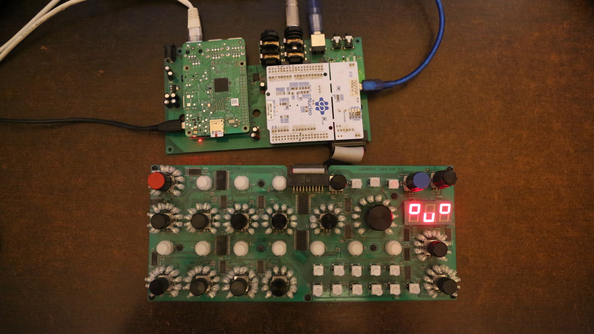

# bassline-junkie



`bassline-junkie` is a C++ synth and benchmark project built with CMake. The main executable links against ALSA and CMake's Threads package, and the optional benchmark suite is pulled in through CMake when enabled.

## Related Projects

- [bassline-junkie](https://github.com/lohisynths/bassline-junkie): C++ synthesizer engine, build scripts, and benchmark project.
- [bassline-junkie-interface_v2](https://github.com/lohisynths/bassline-junkie-interface_v2): User interface companion for controlling and interacting with bassline-junkie.
- [lohi-buildroot](https://github.com/lohisynths/lohi-buildroot): Buildroot setup for producing the embedded Linux toolchain and target system used by LOHI synth projects.

## Requirements

- Linux
- CMake 3.12 or newer
- A C++11 compiler (`gcc` or `clang`)
- ALSA development headers, for example `libasound2-dev` on Debian/Ubuntu
- `python3`, `numpy`, and `matplotlib` for the plotting scripts
- For ARM64 cross-builds, a Buildroot toolchain exposed through `TOOLCHAIN_PATH_DIR`

## Build

From the repository root:

```bash
# Debug build with GCC
./build.sh gcc Debug

# Optimized host build with GCC
./build.sh gcc Release

# Debug build with Clang
./build.sh clang Debug

# ARM64 cross-build
export TOOLCHAIN_PATH_DIR=/path/to/buildroot/output/host
./build.sh arm64 Release
```

`build.sh` creates a `build/` directory and runs CMake there. The `Release` option maps to CMake `RelWithDebInfo`.

## Run

The main executable is built as `bassline-junkie` inside the `build/` tree. Run it from there or copy it to the target device.

## Benchmarks And Tests

Unit tests and benchmarks are only added when `BASSLINE_JUNKIE_TESTING_ENABLED` is enabled in CMake. When that option is on, CMake also downloads Google Benchmark automatically.
